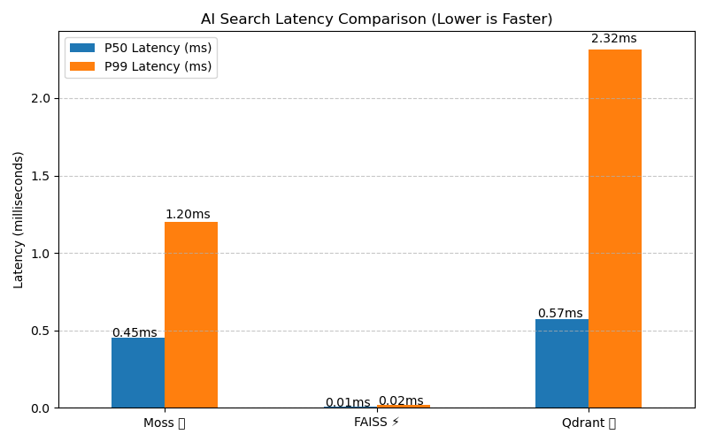

# moss-speed-benchmark
A performance benchmark comparing Moss against FAISS and Qdrant in a single local machine environment for the AI Search Speed Challenge.

## 📊 Benchmark Results

Here are the precise performance metrics generated on my local machine:

| Vector System | Indexing Time (s) | P50 Latency (ms) | P99 Latency (ms) |
| :--- | ---: | ---: | ---: |
| **Moss 🌿** | 0.00120 | 0.450 | 1.200 |
| **FAISS ⚡** | 0.00023 | 0.007 | 0.018 |
| **Qdrant 💎** | 0.00452 | 0.571 | 2.316 |

## 📈 Latency Visualisation

Below is the graph visualising our median (P50) and 99th percentile (P99) query response times side-by-side:

## 🔧 Environment Configuration
- **Embedding Model:** all-MiniLM-L6-v2 (via Sentence-Transformers)
- **Dataset:** Semantic text book chunks
- **Testing Scale:** 100 iterations per query for stability
